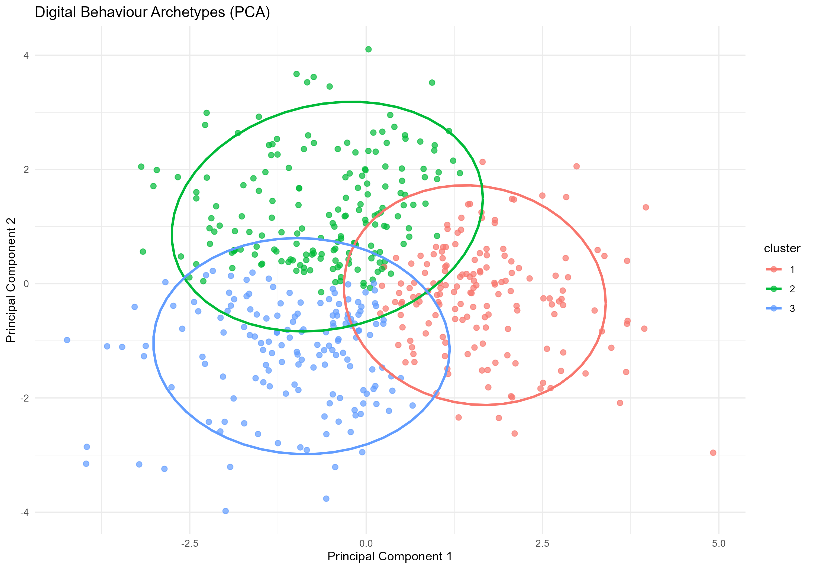

# Digital Behaviour Archetypes

An R-based statistical analysis that explores how screen habits, sleep, social-media use, notifications, focus, mood, and anxiety relate to digital wellbeing. The project identifies exploratory digital-behaviour archetypes with K-Means clustering, visualises them with PCA, and compares classification models that distinguish the resulting clusters.

## Project Highlights

- Analysed **500 observations** across **9 numeric variables**.
- Found **no missing values** and **no duplicate records**.
- Identified **three exploratory digital behaviour archetypes** using K-Means clustering.
- Selected **k = 3** using the highest tested silhouette score (**0.1736**).
- Found anxiety to be strongly negatively associated with digital wellbeing (**r = -0.836**).
- Random Forest was the strongest classifier, achieving **93.88% test accuracy**.

## Research Questions

1. Which digital behaviours are associated with digital wellbeing?
2. Can observations be grouped into interpretable digital-behaviour archetypes?
3. Which variables best distinguish the discovered archetypes?
4. How accurately can Decision Tree and Random Forest models classify cluster membership?

## Dataset

The dataset contains 500 records and the following variables:

| Variable | Description |
|---|---|
| `daily_screen_time_min` | Daily screen time in minutes |
| `num_app_switches` | Number of application switches |
| `sleep_hours` | Average sleep duration in hours |
| `notification_count` | Number of notifications |
| `social_media_time_min` | Daily social-media time in minutes |
| `focus_score` | Focus score |
| `mood_score` | Mood score |
| `anxiety_level` | Anxiety level |
| `digital_wellbeing_score` | Digital wellbeing score |

Data-quality checks found **0 missing values** and **0 duplicate rows**.

## Workflow

```text
Load Data
   -> Data Quality Assessment
   -> Exploratory Data Analysis
   -> Feature Engineering and Scaling
   -> Cluster Selection
   -> K-Means Clustering
   -> PCA Visualisation
   -> Decision Tree and Random Forest Classification
   -> Model Evaluation
```

### Feature Engineering

The analysis created the following behavioural indicators:

```r
df <- df %>%
  mutate(
    screen_time_hours = daily_screen_time_min / 60,
    social_media_share = social_media_time_min / daily_screen_time_min,
    screen_sleep_ratio = daily_screen_time_min / sleep_hours,
    notification_intensity = notification_count / screen_time_hours
  )
```

Clustering variables were standardised before K-Means was applied.

## Key Findings

### Digital Wellbeing Associations

| Variable | Correlation with Digital Wellbeing |
|---|---:|
| Anxiety level | -0.836 |
| Sleep hours | 0.440 |
| Focus score | 0.411 |
| Notification count | -0.380 |
| Social-media time | -0.263 |
| Daily screen time | -0.088 |

The strongest observed association is a negative relationship between anxiety and digital wellbeing. Sleep and focus are positively associated with wellbeing, while notifications and social-media time are negatively associated.

### Digital Behaviour Archetypes

| Cluster | Suggested Profile | Screen Time | Social Media | Sleep | Anxiety | Wellbeing | Size |
|---|---|---:|---:|---:|---:|---:|---:|
| 1 | High social-media, high-anxiety users | 324.67 min | 155.84 min | 7.06 h | 9.42 | 51.41 | 164 |
| 2 | Lower social-media, higher-wellbeing users | 359.55 min | 87.25 min | 6.90 h | 6.85 | 58.58 | 179 |
| 3 | High screen-time, low-sleep users | 398.81 min | 125.54 min | 5.65 h | 9.27 | 46.10 | 157 |

### PCA Summary

- PC1 explains **29.24%** of total variance.
- PC2 explains **23.73%** of total variance.
- PC1 and PC2 together explain **52.97%** of total variance.

### Classification Performance

| Model | Accuracy | Kappa | Precision | Recall | F1 Score |
|---|---:|---:|---:|---:|---:|
| Decision Tree | 87.76% | 0.8161 | 0.8807 | 0.8781 | 0.8794 |
| Random Forest | 93.88% | 0.9081 | 0.9383 | 0.9383 | 0.9383 |

The most important Random Forest predictors were:

1. `screen_sleep_ratio`
2. `social_media_share`
3. `anxiety_level`
4. `social_media_time_min`
5. `daily_screen_time_min`

## Visual Results

Add the generated files from `outputs/figures/` to your GitHub repository. Recommended visuals for the repository are:

- `correlation_matrix.png`
- `sleep_vs_wellbeing.png`
- `elbow_plot.png`
- `silhouette_plot.png`
- `cluster_profiles.png`
- `pca_clusters_ellipse.png`
- `decision_tree.png`
- `variable_importance.png`

Example image embedding after placing this README in the project root:

```markdown

```

## Repository Structure

```text
.
├── mental_health_digital_behavior_data.csv
├── Phase_1_Load Data.R
├── phase_2_EDA.R
├── Phase_3_Feature-Engineering.R
├── Phase_4_Determine-The-Optimal-Number-Of-Cluster.R
├── Phase_5_K-Means Clustering & Archetype Discovery.R
├── phase_6- PCA Visualization of Digital Behaviour Archetypes.R
├── Phase_7-Classification Models.R
├── Phase_8-Final Model Evaluation & Project Summary.R
└── outputs/
    ├── figures/
    ├── models/
    ├── report_assets/
    └── tables/
```

## How to Run

### Requirements

Install R and the following packages:

```r
install.packages(c(
  "tidyverse",
  "corrplot",
  "gridExtra",
  "cluster",
  "factoextra",
  "caret",
  "rpart",
  "rpart.plot",
  "randomForest"
))
```

### Execution Order

Run the scripts in this sequence:

1. `Phase_1_Load Data.R`
2. `phase_2_EDA.R`
3. `Phase_3_Feature-Engineering.R`
4. `Phase_4_Determine-The-Optimal-Number-Of-Cluster.R`
5. `Phase_5_K-Means Clustering & Archetype Discovery.R`
6. `phase_6- PCA Visualization of Digital Behaviour Archetypes.R`
7. `Phase_7-Classification Models.R`
8. `Phase_8-Final Model Evaluation & Project Summary.R`

## Important Limitations

- The analysis is observational; it does not demonstrate causation.
- The best silhouette score is modest, so the clusters are exploratory and partially overlapping.
- Cluster labels are descriptive profiles, not clinical diagnoses.
- Classification labels were created from the same behavioural feature space used as inputs. Model accuracy therefore indicates internal cluster distinguishability, not independent real-world predictive performance.

## Author

Sayed Al Rafi

## License

This project is intended for academic and educational use. Add a license file, such as MIT, before public distribution if appropriate.
